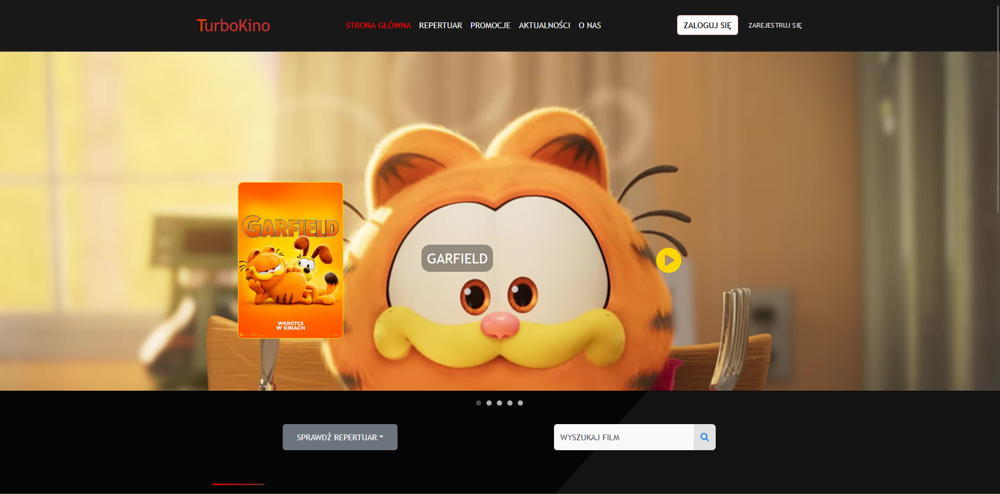
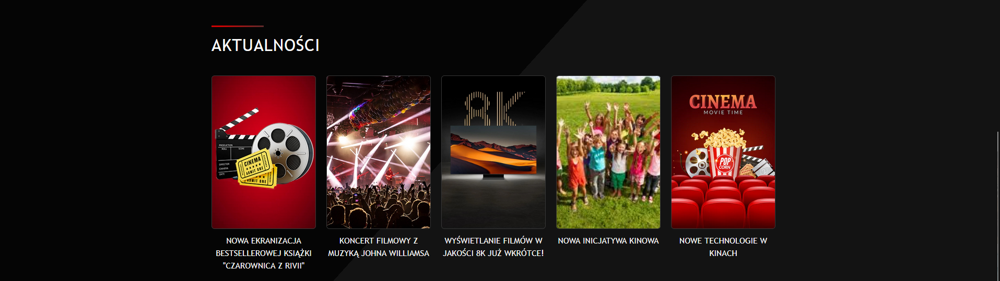
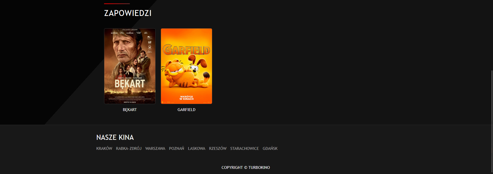
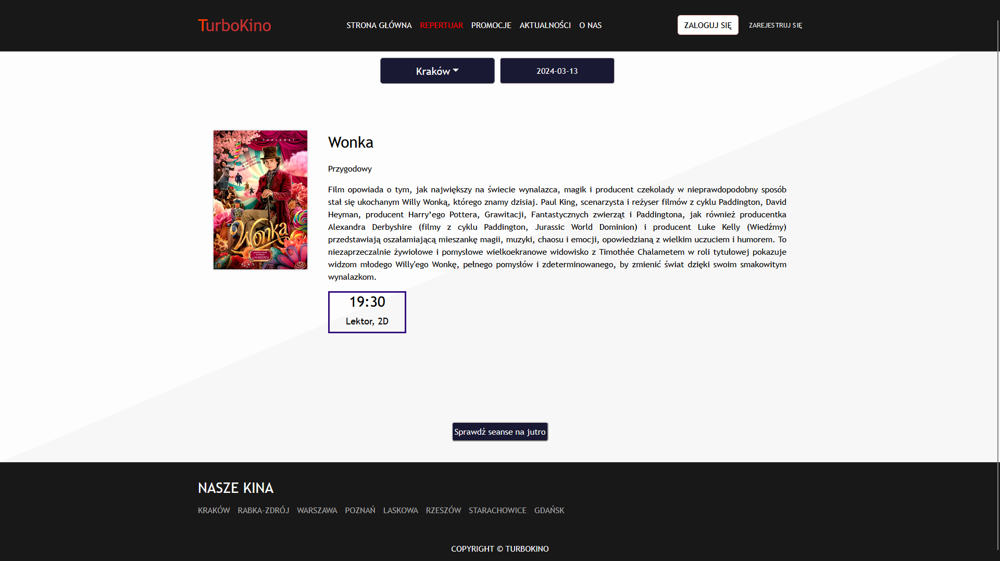
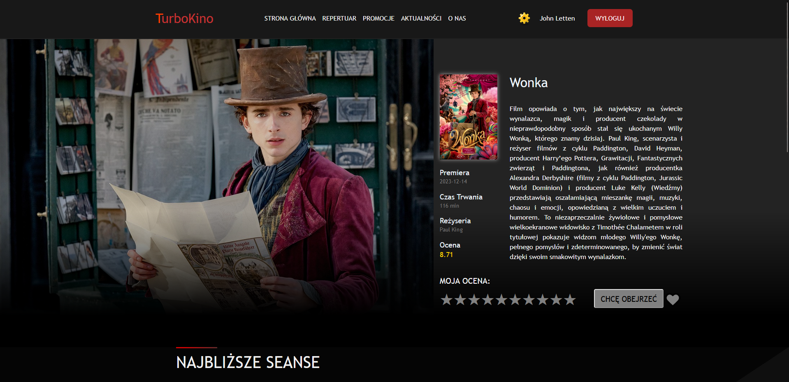
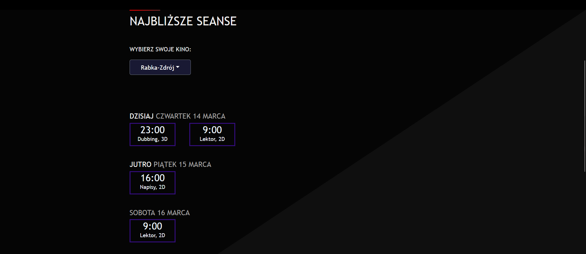
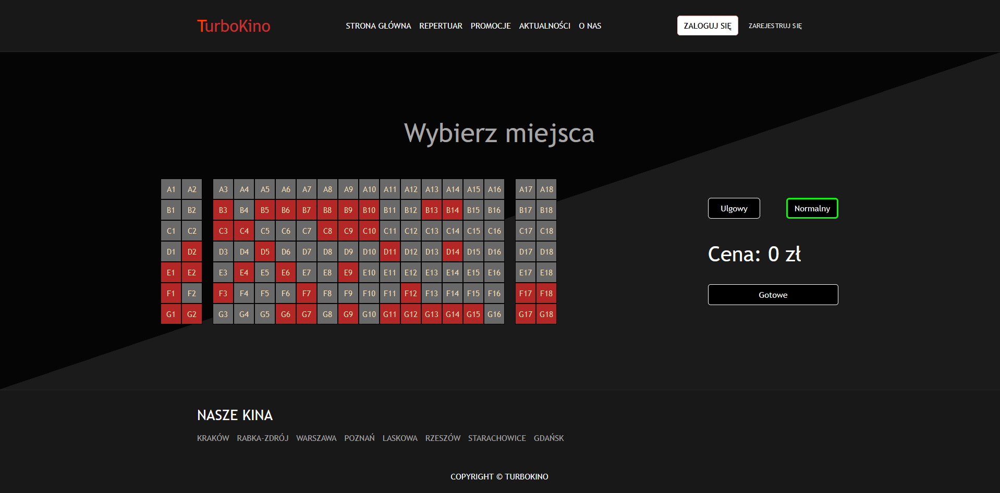
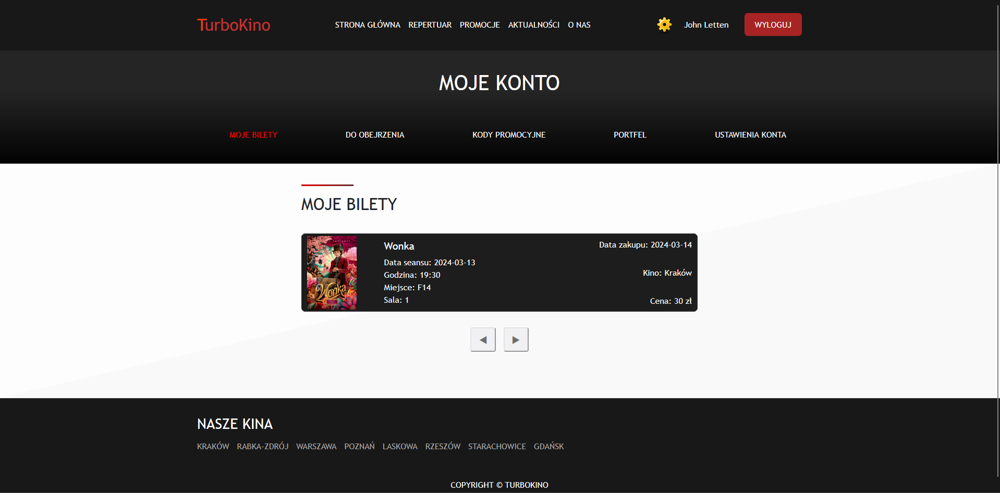
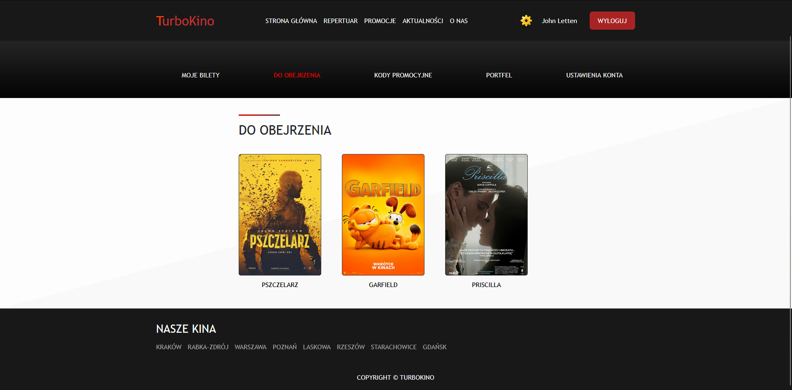

# Cinema Chain Support and Management System

Web application used for managing and supporting the operations of a cinema chain built in Java Spring Boot, React.js and Oracle SQL.

 **Table of content:**

- [Description](#description)
- [Technologies](#technologies)
- [Setup](#setup)
- [Screenshots](#Screenshots)
- [Credits](#credits)
- [License](#license)

## Description

This web application is designed to serve as a comprehensive platform for a cinema network. This app is used as a website for cinema network, and allows users to perform various of activities, such as buying tickets for a movie shown in cinema chosen by a client, managing user's accounts by an admin or adding new screenings at specific times by a employee. Below is a short list of the most useful and important features website offers:

#### For Customers

Customers can enjoy a seamless experience using this web app thanks to its quality and ease of use, with features including:

- Easily browse movie listings, select showtimes and purchase tickets online for a movie at the cinema of their choice
- Register, login, manage personal data, history of bought tickets, personal "To watch list", which contains movies that customer wants to see
- Movie page, that contains all the information about the movie, all screenings, ratings and space for customer's own rating of that movie
- Promotions and news sites containing all of the useful information about promos and news

#### For Administrators

Administrators have access to management tools, enabling him to:

- Create new employee accounts
- Block and unblock user accounts
- View a list of all cinemas and users

#### For Employees

Employees have ability to manage a cinema that they work in, giving them access to:

- View a list of shows and movies
- Adding a new movie to the movies database
- Creating a new screening of a selected movie for a specific date and time

## Technologies

For our project we used reliable and advanced technologies, such as:

- Java Spring Boot: Leveraging the Spring framework for building robust and scalable backend services, we ensure the reliability and performance of our application logic.
- React.js: Utilizing React.js for our frontend development allows us to create dynamic and interactive user interfaces, providing a smooth and intuitive experience for customers and administrators alike.
- Oracle SQL: Employing Oracle SQL as our database management system enables efficient storage, retrieval, and management of data related to cinemas, movies, users, and more.
- Spring Security: Integrating Spring Security provides robust authentication and authorization mechanisms, ensuring secure access control for both customers and administrators.
- RESTful API: Leveraging RESTful principles, our backend exposes a set of well-defined endpoints that allow seamless interaction with the application's resources. This architectural style promotes scalability, modifiability, and interoperability, facilitating integration with various frontend clients and third-party services.
- JSON Web Tokens (JWT): Using JWT for token-based authentication enables stateless and secure communication between the frontend and backend components of our application.

## Setup

To set up the Cinema Chain Support and Management System locally, follow these steps:

#### Prerequisites

- Java Development Kit (JDK): Ensure you have Java JDK installed on your system. You can download it from Oracle's website.
- Node.js: Install Node.js to manage dependencies and run the React.js frontend. You can download it from the official website.

#### Launching

1. Clone this repository to your local machine using: `git clone https://github.com/lukiiis/cinema_chain`
2. Navigate to the Spring Boot root directory: `cd cinema_chain_spring`
3. Run the backend application by typing in terminal: `mvn spring-boot:run`, or by launching `CinemaChainApplication.java` file in your IDE
4. Navigate to the React.js root directory: `cd ../cinema_chain_react`.
5. Install dependencies: `npm install`
6. Start the React development server: `npm start`

The frontend server will start running at http://localhost:3000. You can access the website by visiting this URL in your web browser.

## Screenshots

Couple of screenshots of the website:

#### Home Page

#### Repertory page

#### Movie page

#### Reservations page

#### User dashboard

## Credits

The cinema chain project was created in collaboration with the following individuals:

[@lukiiis](https://www.github.com/lukiiis)

[@zysio](https://www.github.com/zysio)

## License

This project is licensed under the Apache License
